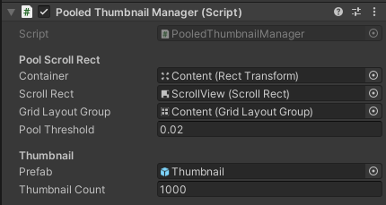

# Summary

Unity version: 2021.3.0f1
I created a new scene called **MainMenu - Optimized**.  
I also created a new monobehaviour component called **PooledThumbnailManager** to replace the old ThumbnailManager.  

## Constraints:
	- The solution only works for vertical scrolling and a GridLayoutGroup
	- The grid layout group should have "Fixed Column Count" constraint
	- The number of elements cannot change during runtime

## Improvements:
	- Support horizontal scrolling
	- Support HorizontalLayoutGroup and VerticalLayoutGroup
	- Ability to change the number of elements during runtime so we can check various resolutions easily